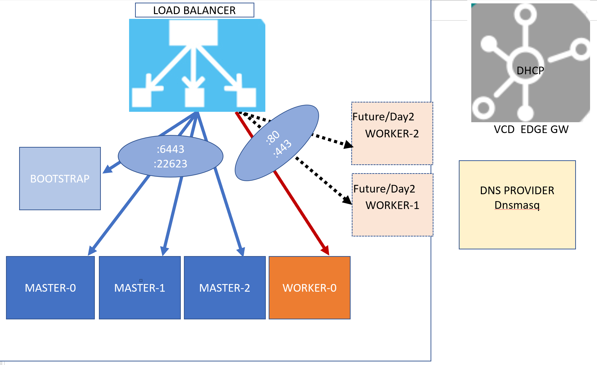

# vcd_toolkit_for_openshift
1.  [Introduction](#introduction)
2.  [Prerequisites](#Prerequisites)
3.  [Installation](#installation)
## Introduction
The VCD Toolkit for OpenShift contains required articats to create OpenShift environment on vCloud Director. This tookit, once all the environment variables populated with valid values, create ignition file for the deployemnt, updates the DNS server (See prerequisite below). The toolkit then creates following virtual machines on the org/orgvdc using Terraform.

Loadbalancer
Bootstrap 
Master-0 
Master-1
Master-2
Worker-0

Once the vms are deployed the toolkit applies the customer properties and attaching the appropriate ignition files to vms and powers them on. The bootstrap machin can be shutdown once the environment is configured.

The overall architecture looks like this:

## Prerequisites
* Access to vCloud Director with org. admin user
* Driver Linux machine accessible from all VM which will be configured as part of OpenShift installation.
* DNSMASQ configured as DNS server on Driver machine
* Accessible DHCP server on organisation network 
* At least 6 IP address on this organisation network (In future extra IP will be needed as worker node added)
* Openshift template for vcenter is available from catalogue
* LoadBalaner template is available from the catalogue
** Test

